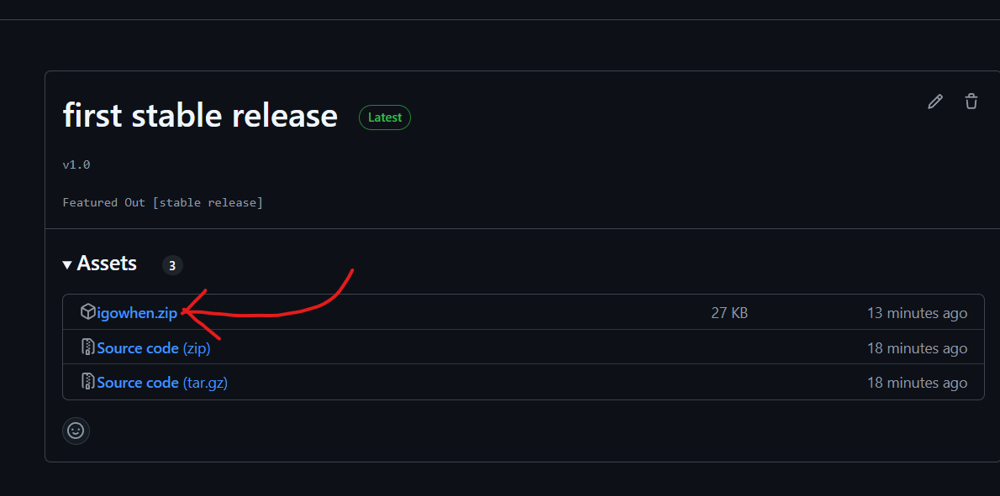
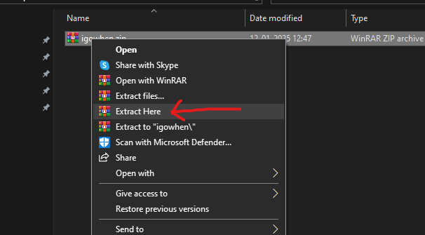
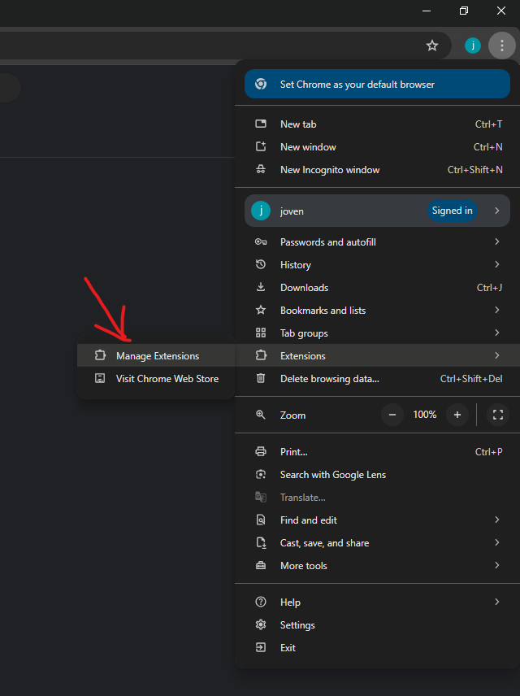
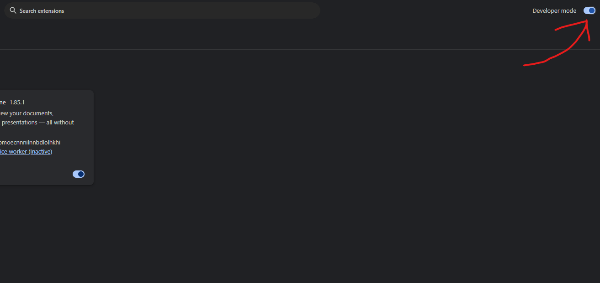
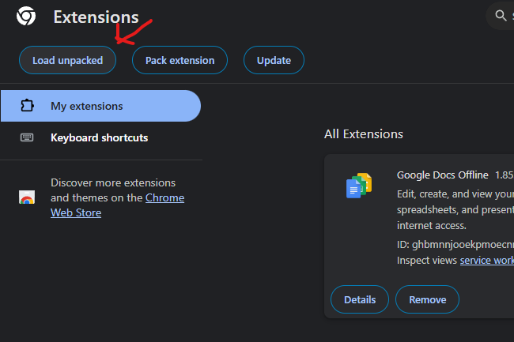
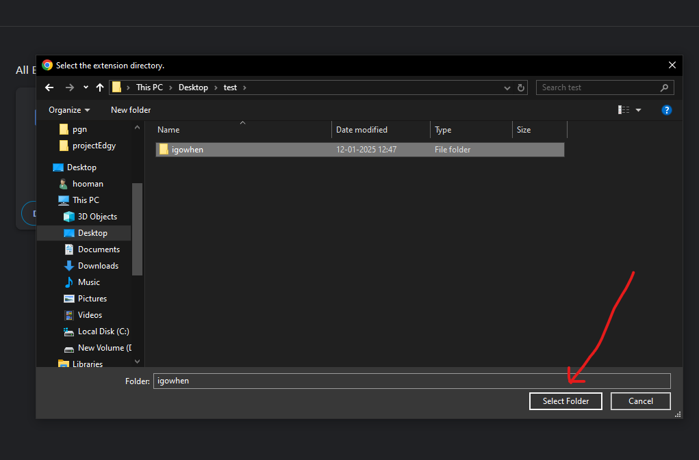
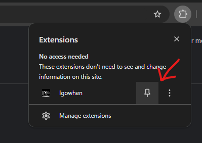

# I go when?

A question worth answering, follow the guiode below to get the answer:

```
Note: This extension works for attendance page on people.zoho.in only.

Only chromium based browser's are supported.
```

### Step 1:
Navigate to [Releases](https://github.com/uday-sudo/igowhen/releases) Page and download the latest release:



### Step 2:
Extract the archive to any location



### Step 3:
Navigate to the extension page in your browser.
It can normally be done by pasting this to the url bar.

```chrome://extensions```

Or through the browser menu:



### Step 4:
Enable developer mode, toggle it ON.


Click on ```Load Unpacked``` button



Navigate to where the archive was extracted:



Now reload the attendance page

### Optionally, Pin the extension

