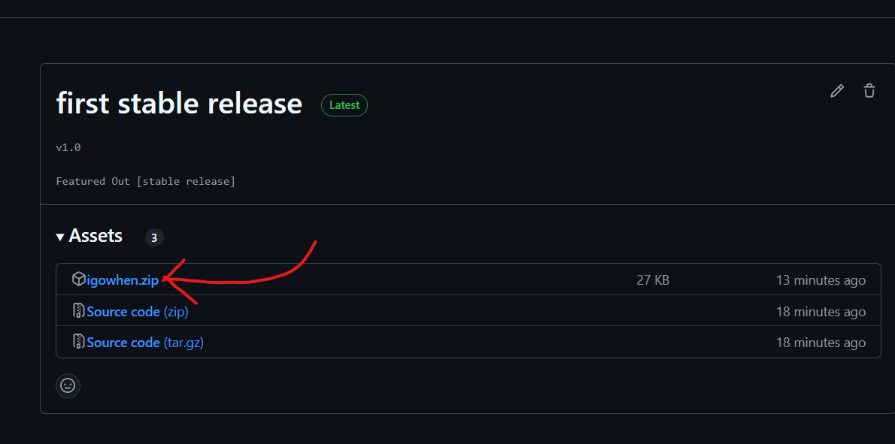
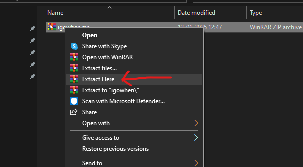
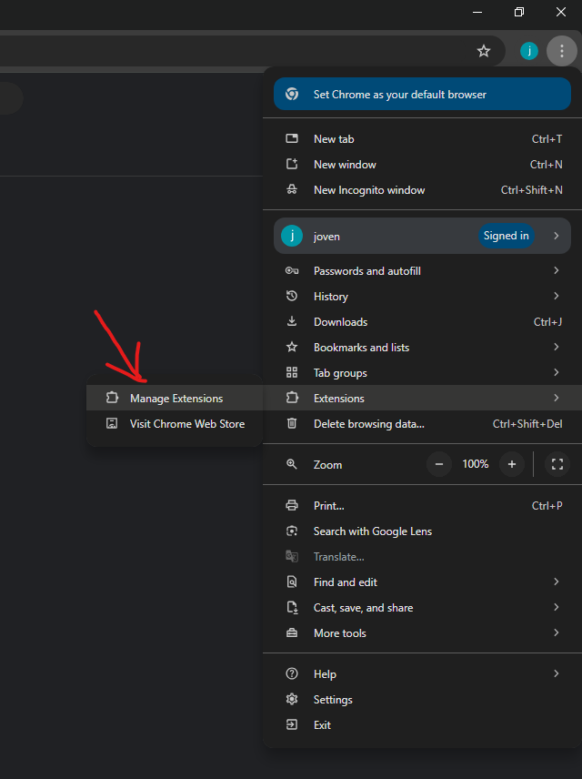
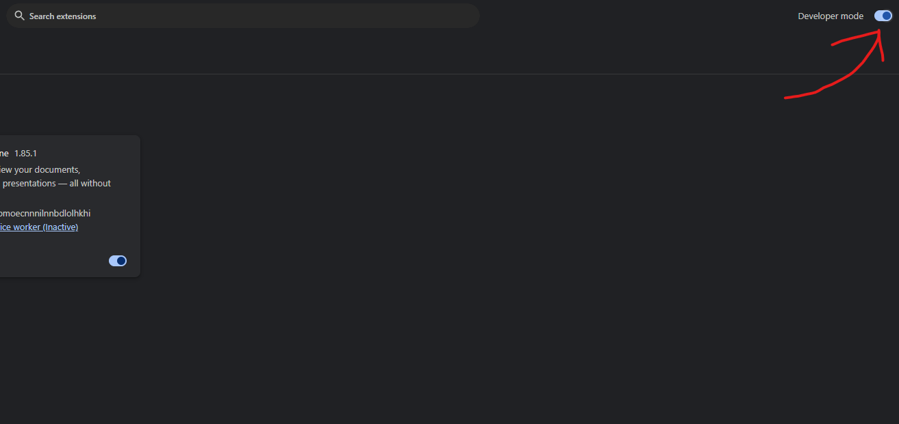
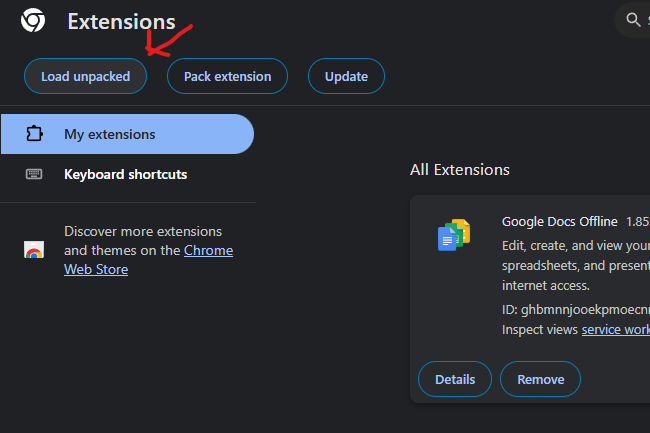
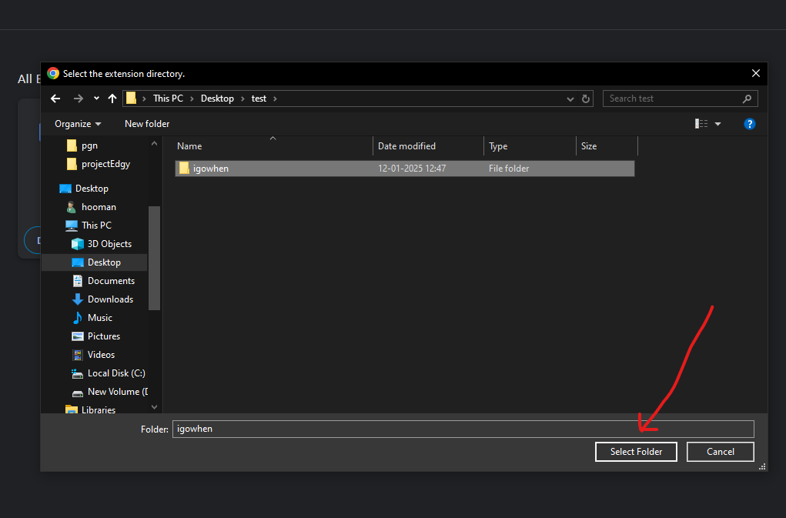
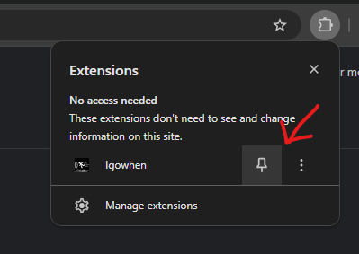

# 🚀 I Go When?

A **simple yet powerful Chrome extension** that helps you with your **Zoho People attendance** — because who doesn’t want to know *when they go*? 😄

> ⚙️ **Note:**  
> This extension works **only** on the attendance page of [people.zoho.in](https://people.zoho.in).  
> ✅ **Supported Browsers:** Chromium-based only (e.g., Chrome, Edge, Brave, etc.)

---

## 🧭 Step 1: Download the Latest Release

Head over to the [**Releases Page**](https://github.com/uday-sudo/igowhen/releases) on GitHub and grab the **latest release**.



---

## 📦 Step 2: Extract the Archive

Unzip or extract the downloaded archive to **any convenient location** on your system.



---

## 🌐 Step 3: Open the Extensions Page

Navigate to your browser’s extensions management page.

You can do this in two ways:

- Paste this directly in your address bar:
  ```
  chrome://extensions
  ```
- Or open it manually through the browser menu:



---

## 🧩 Step 4: Load the Extension

1. **Enable Developer Mode** — toggle the switch **ON** (top right corner).

   

2. Click the **“Load Unpacked”** button.

   

3. Browse to the folder where you **extracted** the archive and select it.

   

4. Once loaded, **reload your attendance page** on Zoho People.

---

## 📌 Optional: Pin the Extension

For quick access, you can **pin the extension** to your browser toolbar.



---

✨ **That’s it!**  
You’re all set to use *I Go When* — effortless, seamless, and stylish.  
Happy tracking! 🕒
